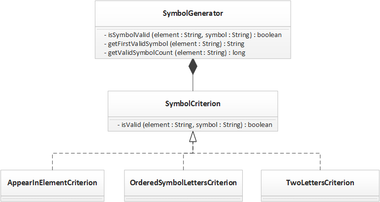

# Splurth Periodic Table
This repository contains the submission for Justin Albano for the [DZone Splurth Periodic Table Java Code Challenge](https://dzone.com/articles/java-code-challenge-chemical-symbol-naming-part-on) and contains all required source code, test cases, and build logic required to perform the desired functionality specified in the challenge. Note that this solution requires **Gradle** to build, test, and execute the functions that solve the described code challenge.

## Design of Solution
Although a single function can be used to solve this challenge, this approach does not allow for extensibility in future releases and does not separate the rules associated with Splurth symbols, allowing for each rule to be tested in isolation. Instead, this solution has an interface, <code>SymbolCriterion</code>, that represents the a single criterion that can be used to check the validity of a symbol. Each rule for a symbol implements this interface and is aggregated in the <code>SymbolGenerator</code> class. This generator class then uses this list of concrete criterion objects to validate a symbol (if the symbol is valid for all criteria, then the symbol is considered valid). This design is illustrated below:

<blockquote><strong>Note</strong>: Although there are 4 rules in the challenge description, there are only 3 concrete criterion classes. This is because rule (3) and (4) in the description can be collapsed into a single rule: If the symbol contains the same letter, stating that the repeated letter must appear twice is the same as stating the second instance of the repeated letter must follow the first instance of the repeated letter. Since the rules do not state otherwise, this solution assumes it is valid for the repeated letter to appear <em>more than twice</em>, so long as it appears <em>at least twice</em>. For example, the symbol <code>Uu</code> is valid for the element <code>Zuulun</code>.</blockquote>

In order to inject these concept criterion objects into the generator without creating a dependency directly between the generator and the concrete criterion objects, [Spring Dependency Injection (DI)](http://docs.spring.io/spring/docs/current/spring-framework-reference/html/beans.html). This allows the dependencies to be specified in an XML format (although an annotation-base approach can be used). Using this approach, a new rule can be added by creating a new concrete criterion object and adding its definition to the XML DI specification file.